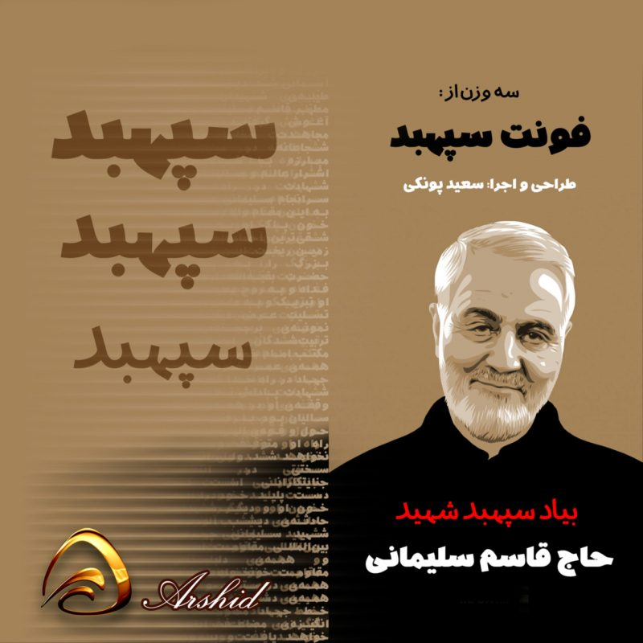

# سپهبد
A Persian (Farsi) Font with variable version
For HajGhasem Soleimani



فونت فارسی سپهبد  
[نمایش فونت](https://tarh.in/product/%d9%81%d9%88%d9%86%d8%aa-%d8%b3%d9%be%d9%87%d8%a8%d8%af-%d8%b1%d8%a7%db%8c%da%af%d8%a7%d9%86/)  

## Known problems for variable version
- mark placement distortion.

## To Do (variable)
- [x] Adding all 3 Weights as masters to variable version.
- [ ] Font testing page
- [ ] Latin section is empty. It's better to use an opensource variable font with a wide range.
- [ ] Testing font in all supported programs.
- [ ] Adding other axes.

## طریقه استفاده در صفحات وب

<p dir="rtl">
کد زیر را در قسمت style یا فایل css وارد نمایید:
</p>


```css
@font-face {
  font-family: sepahbod;
  src: url('sepahbod-n.eot');
  src: url('sepahbod-n.eot?#iefix') format('embedded-opentype'),
       url('sepahbod-n.woff2') format('woff2'),
       url('sepahbod-n.woff') format('woff'),
       url('sepahbod-n.ttf') format('truetype');
  font-weight: normal;
}

```

## Install

Grab the [latest release](https://github.com/saelozahra/sepahbod-font/releases/latest) file.

Or [RawGit](https://rawgit.com) CDN:

```html
<link href="https://cdn.rawgit.com/saelozahra/sepahbod-font/v[X.Y.Z]/dist/font-face.css" rel="stylesheet" type="text/css" />
```

Replace [X.Y.Z] with the latest version (e.g. 1.0.0) and integrate the font into your CSS:

```
font-family: 'sepahbod', sans-serif;
```


## Contributors

- Amir Lotfi [@saelozahra](https://saelozahra.ir)

## License
2016 Saeed Ponaki ([@saeedponaki](https://tarh.in/product/%d9%81%d9%88%d9%86%d8%aa-%d8%b3%d9%be%d9%87%d8%a8%d8%af-%d8%b1%d8%a7%db%8c%da%af%d8%a7%d9%86/)). See the `LICENSE` file.

